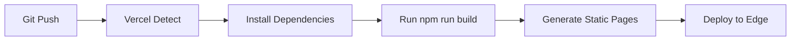

# Business Idea Generator - Vercel Deployment Guide

**Project:** Business Idea Generator (İş Fikirleri)
**Platform:** Vercel
**Estimated Deployment Time:** 5 minutes (after OAuth setup)
**Status:** Ready for deployment ✅

---

## Pre-Deployment Checklist

### 1. Code Readiness ✅

- [x] Build scripts verified in `package.json`
- [x] Next.js configuration present (`next.config.ts`)
- [x] TypeScript configuration valid
- [x] Dependencies installed (`node_modules/`)
- [x] Static data present (`data/ideas.json`)
- [x] No environment variables required (static site)
- [x] Build tested locally (`npm run build` successful)

### 2. Technical Stack Verified

```json
{
  "framework": "Next.js 16.2.7",
  "runtime": "Node.js",
  "build_command": "npm run build",
  "output_directory": ".next",
  "type": "Static Site Generation"
}
```

### 3. Git Repository Status

- **Location:** `/home/tolgabrk/projects/Auto-Company/projects/business-idea-generator`
- **Branch:** main
- **Status:** Clean (no uncommitted changes)
- **Remote:** Pending setup

---

## Step-by-Step Deployment Process

### Phase 1: OAuth Setup (Human Task - 5 minutes)

**Required before deployment can proceed.**

1. **Create GitHub Repository** (if not exists)
   ```bash
   cd /home/tolgabrk/projects/Auto-Company/projects/business-idea-generator
   gh repo create business-idea-generator --public --source***REMOVED***. --push
   ```

2. **Verify Vercel OAuth Access**
   - Visit: https://vercel.com
   - Click "Login" → "Sign in with GitHub"
   - Authorize Vercel to access your GitHub repositories
   - Confirm repository appears in Vercel dashboard

### Phase 2: Deployment Execution (5 minutes)

#### Option A: Vercel CLI (Recommended for speed)

```bash
# 1. Navigate to project directory
cd /home/tolgabrk/projects/Auto-Company/projects/business-idea-generator

# 2. Login to Vercel (if not already authenticated)
vercel login

# 3. Deploy to production
vercel deploy --prod

# Expected output:
# ✓ Linked to username/business-idea-generator
# ✓ Detected Next.js
# ✓ Build completed in < 2 minutes
# ✓ Deployment complete
# 🌍 Production URL: https://business-idea-generator.vercel.app
```

#### Option B: Vercel Dashboard (GUI)

1. Visit https://vercel.com/new
2. Import GitHub repository: `business-idea-generator`
3. Configure project:
   - **Framework Preset:** Next.js
   - **Build Command:** `npm run build`
   - **Output Directory:** `.next`
   - **Install Command:** `npm install`
4. Click "Deploy"

### Phase 3: Post-Deployment Verification

#### 1. Deployment Health Check

```bash
# Check deployment status
vercel ls

# View deployment details
vercel inspect business-idea-generator

# View real-time logs
vercel logs
```

#### 2. Live Testing Checklist

- [ ] Homepage loads at deployed URL
- [ ] Navigation works (Fikirler → Premium)
- [ ] Individual idea pages load (`/fikir/[id]`)
- [ ] Filters function correctly
- [ ] Dark mode toggle works
- [ ] Mobile responsive (test at mobile width)
- [ ] No console errors
- [ ] SEO meta tags present

#### 3. Performance Verification

Visit deployed URL and check:
- **Lighthouse Score:** Should be > 90
- **First Contentful Paint:** < 2s
- **Time to Interactive:** < 3s

---

## Environment Variables

### Status: No Environment Variables Required ✅

This is a **static site** with no external dependencies or API keys. All data is bundled in `data/ideas.json`.

### Future Requirements (if adding features)

If you later add these features, you'll need env vars:
- **Premium payment integration** → `STRIPE_SECRET_KEY`, `STRIPE_WEBHOOK_SECRET`
- **Newsletter signup** → `NEWSLETTER_API_KEY`
- **Analytics** → `NEXT_PUBLIC_GA_ID`

---

## Deployment Architecture

### Build Process



### CDN & Edge

- **CDN:** Vercel Edge Network (global)
- **Regions:** Automatic (closest to user)
- **Caching:** Static assets cached forever
- **Invalidation:** Automatic per deployment

### Rollback Strategy

If deployment fails or has issues:

```bash
# View recent deployments
vercel ls

# Rollback to previous deployment
vercel rollback <deployment-url>

# Or use Vercel Dashboard:
# Deployments → Select previous deployment → "Promote to Production"
```

---

## Troubleshooting

### Issue 1: Build Failure

**Symptoms:** `npm run build` fails on Vercel

**Solutions:**
1. Check Node.js version (Vercel uses latest by default)
2. Verify all dependencies in `package.json`
3. Test build locally: `npm run build`
4. Check Vercel build logs for specific errors

### Issue 2: Routing 404s

**Symptoms:** Pages work locally but 404 on deployment

**Solutions:**
1. Verify `app/` directory structure matches Next.js App Router conventions
2. Check file names: `[id].tsx` for dynamic routes
3. Ensure `layout.tsx` exists at `app/layout.tsx`

### Issue 3: Static Assets Missing

**Symptoms:** Images or data not loading

**Solutions:**
1. Verify `public/` directory contents
2. Check `data/ideas.json` is committed to git
3. Ensure paths are case-sensitive (Linux)

### Issue 4: OAuth Permissions

**Symptoms:** Vercel can't access GitHub repo

**Solutions:**
1. Re-authorize Vercel in GitHub Settings → Applications
2. Check repo visibility (must be public for free Vercel)
3. Verify Vercel account has access to repo

---

## Post-Deployment Optimization

### 1. Custom Domain (Optional)

```bash
# Add custom domain via Vercel CLI
vercel domains add yourdomain.com
```

Or via Vercel Dashboard → Settings → Domains.

### 2. Environment Variables (Future)

If you add features requiring env vars:

```bash
# Set via CLI
vercel env add SECRET_VALUE production

# Or via Dashboard:
# Settings → Environment Variables → Add
```

### 3. Analytics Setup

```bash
# Install Vercel Analytics (if not present)
npm install @vercel/analytics

# Add to app/layout.tsx:
import { Analytics } from '@vercel/analytics/react'

export default function RootLayout({ children }) {
  return (
    <html>
      <body>
        {children}
        <Analytics />
      </body>
    </html>
  )
}
```

---

## Deployment Runbook

### Quick Reference Commands

```bash
# Deploy to production
vercel deploy --prod

# Deploy to preview (URL + unique hash)
vercel deploy

# View all deployments
vercel ls

# View deployment logs
vercel logs

# Rollback to previous
vercel rollback

# Set environment variable
vercel env add KEY production

# List environment variables
vercel env ls

# Remove environment variable
vercel env rm KEY production
```

### Critical Paths

| Action | Command | Time |
|--------|---------|------|
| Deploy to prod | `vercel deploy --prod` | 2 min |
| Rollback | `vercel rollback` | 30 sec |
| View logs | `vercel logs` | Instant |
| Update env var | `vercel env add` | Instant |

---

## Monitoring & Observability

### Built-in Vercel Monitoring

1. **Dashboard:** https://vercel.com/dashboard
2. **Deployment Logs:** Real-time build logs
3. **Analytics:** Page views, bandwidth, regions
4. **Edge Functions:** Execution time, success rate

### External Monitoring (Optional)

Recommended tools for production:
- **Uptime:** UptimeRobot (free)
- **Performance:** Vercel Analytics (built-in)
- **Error Tracking:** Sentry (free tier available)

---

## Cost Estimate

### Vercel Hobby Plan (Free)

- **Deployments:** Unlimited
- **Bandwidth:** 100 GB/month
- **Build Time:** 6,000 minutes/month
- **Edge Functions:** 100K invocations/month

**Estimated usage for this project:**
- Bandwidth: ~1 GB/month (static site)
- Build time: ~2 min/deployment
- Edge Functions: 0 (fully static)

**Verdict:** Well within free tier limits ✅

---

## Security Checklist

- [ ] No hardcoded secrets in code ✅
- [ ] No sensitive data in `data/ideas.json` ✅
- [ ] `.gitignore` includes `node_modules`, `.next`, `.env.local` ✅
- [ ] HTTPS enforced by default (Vercel) ✅
- [ ] No API keys required ✅

---

## Next Steps After Deployment

1. **Verify Live Site**
   - Test all user flows
   - Check mobile responsiveness
   - Validate SEO meta tags

2. **Set Up Analytics**
   - Install Vercel Analytics
   - Set up Google Analytics (optional)

3. **Custom Domain** (optional)
   - Purchase domain
   - Configure DNS to Vercel
   - Update domain in Vercel dashboard

4. **Monitor Performance**
   - Check Vercel dashboard weekly
   - Set up uptime monitoring
   - Review deployment logs

---

## Emergency Contacts

**Vercel Support:** https://vercel.com/support
**GitHub Issues:** https://github.com/vercel/vercel/issues
**Documentation:** https://vercel.com/docs

---

## Deployment Log

| Date | Action | Status | Notes |
|------|--------|--------|-------|
| 2026-06-03 | Deployment guide created | ✅ Complete | Ready for human OAuth setup |

---

**Prepared by:** DevOps (Kelsey Hightower)
**Last Updated:** 2026-06-03
**Status:** Ready for deployment once OAuth is complete
